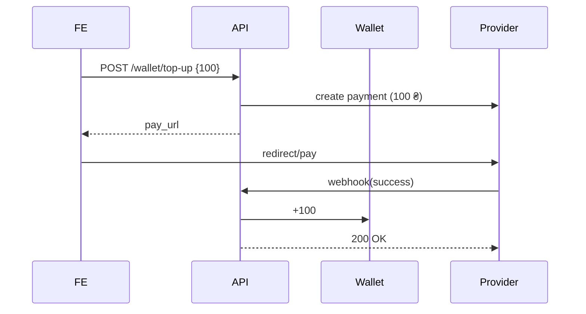

# 💰 Wallet Spec — Finance & Payments (v0.1)

> Отвечает за баланс пользователей/организаций, транзакции, топ‑апы и списания за продвижение объявлений.
> Связан с app‑ами **listing**, **assistant**, партнёрскими кабинетами (СТО, дилеры).

---

## 1. Модели

```python
class Wallet(models.Model):
    user = models.OneToOneField(settings.AUTH_USER_MODEL, on_delete=models.CASCADE, null=True, blank=True)
    organization = models.OneToOneField("partners.Organization", on_delete=models.CASCADE, null=True, blank=True)
    balance = models.DecimalField(max_digits=12, decimal_places=2, default=0)  # хранится в UAH

class Transaction(models.Model):
    wallet = models.ForeignKey(Wallet, on_delete=models.CASCADE, related_name="transactions")
    amount = models.DecimalField(max_digits=12, decimal_places=2)  # + пополнение, – расход
    type = models.CharField(max_length=12, choices=[
        ("top_up", "Пополнение"),
        ("promo", "Продвижение"),
        ("lead_fee", "Контакт‑лид"),
        ("payout", "Выплата партнёру"),
    ])
    status = models.CharField(max_length=8, choices=[("pending","↻"),("done","✔"),("error","✘")], default="pending")
    reference_id = models.CharField(max_length=64, blank=True)  # id платёжки
    created_at = models.DateTimeField(auto_now_add=True)

    class Meta:
        ordering = ["-created_at"]
```

*Баланс всегда обновляется атомарно внутри `Transaction` сервисов.*

### 1.1 Сервисы

```python
def top_up(wallet, amount, payment_ref):
    Transaction.objects.create(wallet=wallet, amount=amount, type="top_up", status="pending", reference_id=payment_ref)

def confirm_top_up(reference_id):
    tx = Transaction.objects.get(reference_id=reference_id)
    tx.status = "done"
    tx.wallet.balance = F("balance") + tx.amount
    tx.wallet.save(update_fields=["balance"])
    tx.save(update_fields=["status"])

def charge_promo(user, promotion, listing):
    wallet = user.wallet
    if wallet.balance < promotion.price:
        raise InsufficientFunds
    with transaction.atomic():
        wallet.balance = F("balance") - promotion.price
        wallet.save(update_fields=["balance"])
        Transaction.objects.create(wallet=wallet, amount=-promotion.price, type="promo", status="done", reference_id=str(listing.id))
```

---

## 2. Эндпоинты (DRF)

| Метод | URL                             | Описание                                   | Auth     |
| ----- | ------------------------------- | ------------------------------------------ | -------- |
| GET   | `/api/wallet/`                  | баланс + 10 последних транзакций           | user/org |
| POST  | `/api/wallet/top-up/`           | `{"amount":100}` → redirect URL провайдера | user/org |
| POST  | `/api/wallet/webhook/`          | колбэк платёжки (id, status)               | provider |
| POST  | `/api/listings/<slug>/promote/` | `{"promotion_id":2}` списать со счёта      | owner    |

### 2.1 JSON примеры

**GET /api/wallet/**

```json
{
  "balance": "320.00",
  "transactions": [
    {"id":91,"type":"top_up","amount":"+500.00","status":"done","created_at":"2025-08-01T10:12:00Z"},
    {"id":92,"type":"promo","amount":"-180.00","status":"done","created_at":"2025-08-01T10:13:12Z"}
  ]
}
```

**Webhook** (`payment_provider → backend`)

```json
{
  "reference_id": "pay_8afc...",
  "status": "success",
  "amount": 500.00
}
```

---

## 3. Потоки



---

## 4. Интеграция с Listing

* `POST /listings/<slug>/promote/` ➜ service `finance.charge_promo()` ➜ `Listing.is_promoted=True`, `promoted_until=now()+duration`.
* Сигнал **`listing.signals.demote_expired`** каждые 6 ч сбрасывает флаг, если `promoted_until` в прошлом.

---

## 5. Партнёрские кошельки (СТО, дилеры)

* `Organization` содержит `type` (`dealer`/`service_station`).
* Дилер платит `lead_fee` при просмотре контакта продавца (`Transaction.type = lead_fee`).
* СТО может получать выплаты (`payout`) за партнёрские услуги (комиссия маркетплейса). API для выплат — `POST /api/finance/payouts/` (только admin).

---

## 6. Безопасность & анти‑фрод

* Все начисления/списания — **atomic** транзакции.
* Webhook проверяет HMAC‑подпись платёжки.
* Ограничение 100 запросов `/top-up/` в час (DRF throttle).

---

## 7. TODO

* [ ] Добавить Celery‑джобу для ежемесячных сводных отчётов (PDF) по `Organization`.
* [ ] Поддержать частичные возвраты (`Transaction.type = refund`).

---

*Контакты владельца модуля: @FinLead*
*Последнее обновление: 01‑08‑2025*
